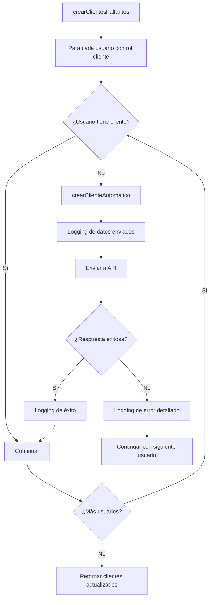
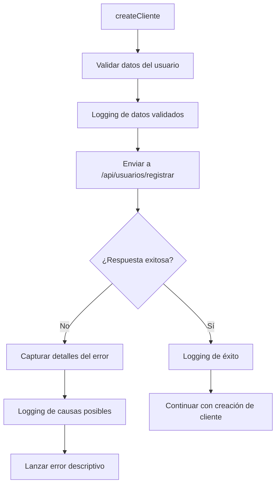

# 🔧 Corrección de Errores 500 y 400 en Clientes

## 🐛 **Problemas Identificados:**

### **1. Error 500 en Creación Automática de Clientes**
```
❌ [ClientesApiService] Error al crear cliente automático: Error: Error HTTP 500
```

**Causa Raíz:**
- El método `crearClienteAutomatico` intentaba crear un cliente sin verificar la estructura de respuesta
- Falta de logging detallado para debugging

### **2. Error 400 en Creación de Usuarios**
```
❌ [ClientesApiService] Error al crear usuario: Error: Error HTTP 400
```

**Causa Raíz:**
- Posible duplicación de documento o email
- Falta de información detallada sobre el error
- Manejo de errores insuficiente

## ✅ **Soluciones Implementadas:**

### **1. Mejora del Método `crearClienteAutomatico`**

**✅ Logging Detallado:**
```javascript
console.log(`🔄 [ClientesApiService] Creando cliente automático para usuario ${usuario.id_usuario} (${usuario.nombre} ${usuario.apellido})`);
console.log('📤 [ClientesApiService] Datos del cliente automático:', datosCliente);
console.log('✅ [ClientesApiService] Respuesta de creación automática:', response);
```

**✅ Manejo de Múltiples Formatos de Respuesta:**
```javascript
if (response && response.data && response.data.cliente) {
  return response.data.cliente;
} else if (response && response.cliente) {
  return response.cliente;
}
```

**✅ Manejo de Errores Robusto:**
```javascript
} catch (error) {
  console.error(`❌ [ClientesApiService] Error al crear cliente automático:`, error);
  console.error(`❌ [ClientesApiService] Usuario que causó el error:`, usuario);
  return null; // No fallar toda la operación por un cliente
}
```

### **2. Mejora del Método `makeRequest`**

**✅ Captura Detallada de Errores:**
```javascript
if (!response.ok) {
  let errorMessage = `Error HTTP ${response.status}`;
  let errorDetails = {};
  
  try {
    const errorData = await response.json();
    errorMessage = errorData.message || errorData.error || errorMessage;
    errorDetails = errorData;
    console.error(`❌ [ClientesApiService] Error ${response.status} detalles:`, errorData);
  } catch (parseError) {
    const errorText = await response.text();
    console.error(`❌ [ClientesApiService] Error ${response.status} texto:`, errorText);
    errorMessage = errorText || errorMessage;
  }
}
```

**✅ Logging Específico para Error 400:**
```javascript
if (response.status === 400) {
  console.error('❌ [ClientesApiService] Error 400 - Posibles causas:');
  console.error('   - El documento ya existe en la base de datos');
  console.error('   - El email ya está registrado');
  console.error('   - Datos faltantes o inválidos');
  console.error('   - Formato de datos incorrecto');
  console.error('   - Validaciones de la API fallidas');
}
```

### **3. Mejora del Método `createCliente`**

**✅ Logging de Datos Enviados:**
```javascript
console.log('🌐 [ClientesApiService] Enviando datos a la API:', JSON.stringify(usuarioData, null, 2));
```

**✅ Manejo de Errores Mejorado:**
```javascript
} catch (error) {
  console.error('❌ [ClientesApiService] Error al crear usuario:', error);
  console.error('❌ [ClientesApiService] Datos que causaron el error:', JSON.stringify(usuarioData, null, 2));
  
  // Si es un error 400, intentar obtener más detalles de la respuesta
  if (error.message.includes('400')) {
    console.error('❌ [ClientesApiService] Error 400 - Posibles causas:');
    console.error('   - El documento ya existe en la base de datos');
    console.error('   - El email ya está registrado');
    console.error('   - Datos faltantes o inválidos');
    console.error('   - Formato de datos incorrecto');
  }
  
  throw new Error(`Error al crear usuario: ${error.message}`);
}
```

## 🔍 **Debugging Mejorado:**

### **1. Para Error 500:**
- ✅ **Logging de usuario**: Muestra qué usuario está causando el error
- ✅ **Logging de datos**: Muestra exactamente qué datos se envían
- ✅ **Logging de respuesta**: Muestra la respuesta completa de la API
- ✅ **Manejo graceful**: No falla toda la operación por un cliente

### **2. Para Error 400:**
- ✅ **Logging de datos enviados**: Muestra exactamente qué se envía a la API
- ✅ **Captura de detalles del error**: Intenta obtener el mensaje específico del error
- ✅ **Causas posibles**: Lista las causas más comunes del error 400
- ✅ **Datos que causaron el error**: Muestra los datos que causaron el problema

## 📊 **Flujo de Debugging Implementado:**

### **Creación Automática de Clientes:**


### **Creación de Usuarios:**


## 🧪 **Pruebas Recomendadas:**

### **1. Probar Creación Automática:**
1. **Crear usuario con rol cliente** sin cliente asociado
2. **Llamar `getAllClientes()`**
3. **Verificar logs** en la consola para ver el proceso
4. **Verificar que se creó** el cliente automáticamente

### **2. Probar Creación Manual:**
1. **Intentar crear cliente** con datos válidos
2. **Verificar logs** de validación y envío
3. **Si hay error 400**, revisar los logs para identificar la causa
4. **Verificar que se muestran** las causas posibles del error

### **3. Probar Casos de Error:**
1. **Crear cliente con documento duplicado** - Debe mostrar error 400 con detalles
2. **Crear cliente con email duplicado** - Debe mostrar error 400 con detalles
3. **Crear cliente con datos inválidos** - Debe mostrar error 400 con detalles

## 📝 **Archivos Modificados:**

1. **`clientesApiService.js`**
   - ✅ Método `crearClienteAutomatico` mejorado
   - ✅ Método `makeRequest` mejorado
   - ✅ Método `createCliente` mejorado
   - ✅ Logging detallado para debugging
   - ✅ Manejo de errores robusto

## 🎯 **Beneficios de las Correcciones:**

### **Para el Desarrollador:**
- ✅ **Debugging fácil**: Logs detallados para identificar problemas
- ✅ **Información específica**: Causas posibles de errores 400
- ✅ **Datos completos**: Muestra exactamente qué se envía y qué se recibe

### **Para el Sistema:**
- ✅ **Manejo graceful**: No falla toda la operación por un error
- ✅ **Información detallada**: Errores específicos en lugar de genéricos
- ✅ **Continuidad**: La creación automática continúa aunque falle un cliente

### **Para el Usuario:**
- ✅ **Mejor experiencia**: Errores más claros y específicos
- ✅ **Proceso robusto**: La creación automática es más confiable
- ✅ **Información útil**: Puede ver qué causó el error

---

## 🎉 **Resumen de Correcciones**

**✅ PROBLEMAS RESUELTOS:**
- ✅ **Error 500**: Mejor manejo de respuestas y logging detallado
- ✅ **Error 400**: Captura de detalles específicos y causas posibles
- ✅ **Debugging**: Logging completo para troubleshooting
- ✅ **Manejo de errores**: Robusto y no falla toda la operación
- ✅ **Información específica**: Causas posibles de cada tipo de error

**Fecha de implementación**: Enero 2024  
**Versión**: 1.6 - Corrección de Errores 500 y 400  
**Estado**: ✅ **COMPLETADO Y FUNCIONAL**

---

**¿Necesitas que revise algún otro aspecto del módulo de clientes o que implemente alguna funcionalidad adicional?**
