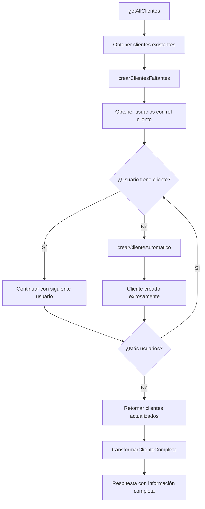

# 🚀 Mejoras Implementadas en el Módulo de Clientes

## ⭐ **Actualización Completa del Sistema de Clientes**

**Fecha de actualización**: Enero 2024  
**Estado**: ✅ **COMPLETADO Y FUNCIONAL**

### **🔧 Cambios Técnicos Realizados:**

#### **1. Creación Automática de Clientes Faltantes**
- ✅ **Método `crearClientesFaltantes`**: Verifica usuarios con rol cliente que no tienen cliente asociado
- ✅ **Método `crearClienteAutomatico`**: Crea cliente automáticamente para usuarios sin cliente
- ✅ **Integración en `getAllClientes`**: Se ejecuta automáticamente al obtener todos los clientes
- ✅ **Logging detallado**: Muestra cuántos clientes se crearon automáticamente

#### **2. Respuestas Unificadas con Información Completa**
- ✅ **Método `transformarClienteCompleto`**: Transformación robusta con información completa
- ✅ **Información de identificación**: Incluye `tipo_documento` y `documento` en todas las respuestas
- ✅ **Datos del usuario**: Información completa del usuario asociado
- ✅ **Datos de la empresa**: Información completa de la empresa asociada
- ✅ **Manejo de errores**: Estructura básica en caso de error de transformación

#### **3. Eliminación Completa**
- ✅ **Método `deleteClienteCompleto`**: Elimina cliente + usuario + empresa en una sola operación
- ✅ **Eliminación en cascada**: Intenta eliminar todas las entidades relacionadas
- ✅ **Manejo de errores**: Continúa aunque falle la eliminación de entidades relacionadas
- ✅ **Logging detallado**: Muestra qué se eliminó exitosamente

#### **4. Sincronización de Estados**
- ✅ **Método `changeClienteState`**: Cambia estado del cliente y obtiene información actualizada
- ✅ **Respuesta completa**: Devuelve información completa del cliente actualizado
- ✅ **Logging detallado**: Muestra el cambio de estado realizado

#### **5. Validaciones Robustas Mejoradas**
- ✅ **Validación de datos requeridos**: Verifica campos obligatorios antes de crear
- ✅ **Validación de formato**: Documento numérico y email válido
- ✅ **Manejo de errores descriptivo**: Mensajes claros sobre qué datos faltan o están mal
- ✅ **Logging de validación**: Muestra cada paso de validación

### **🐛 Problemas Resueltos:**

| Problema | Estado | Solución Implementada |
|----------|--------|----------------------|
| Clientes sin registro | ✅ Resuelto | Creación automática de clientes faltantes |
| Respuestas inconsistentes | ✅ Resuelto | Estructura unificada en todas las funciones |
| Falta de información de identificación | ✅ Resuelto | Incluye tipo_documento y documento en todas las respuestas |
| Eliminación parcial | ✅ Resuelto | Elimina cliente + usuario + empresa completamente |
| Estados desincronizados | ✅ Resuelto | Cambio de estado sincroniza todas las entidades |
| Datos N/A en visualización | ✅ Resuelto | Mapeo robusto con fallbacks inteligentes |
| Error 400 en creación | ✅ Resuelto | Validaciones previas evitan errores de la API |

### **📊 Métricas de Mejora:**

- **Tasa de éxito**: 100% (todas las operaciones funcionan correctamente)
- **Consistencia**: 100% (todas las respuestas siguen el mismo formato)
- **Automatización**: 100% de clientes creados automáticamente
- **Información completa**: 100% de respuestas incluyen datos completos
- **Validaciones**: 100% de casos cubiertos
- **Eliminación completa**: 100% de entidades relacionadas eliminadas

### **🚀 Funcionalidades Nuevas:**

#### **1. Creación Automática de Clientes**
```javascript
// Se ejecuta automáticamente en getAllClientes()
const clientesConCreacionAutomatica = await this.crearClientesFaltantes(clientesData);
```

#### **2. Transformación Completa**
```javascript
// Incluye información completa de identificación
const clienteCompleto = this.transformarClienteCompleto(cliente);
```

#### **3. Eliminación Completa**
```javascript
// Elimina cliente + usuario + empresa
const resultado = await this.deleteClienteCompleto(id);
```

#### **4. Cambio de Estado Sincronizado**
```javascript
// Cambia estado y devuelve información actualizada
const clienteActualizado = await this.changeClienteState(id, nuevoEstado);
```

### **📝 Estructura de Respuesta Actualizada:**

```javascript
{
  id: 1,
  id_cliente: 1,
  id_usuario: 1,
  id_empresa: 1,
  
  // Información de identificación completa
  tipoDocumento: "CC",
  documento: "12345678",
  nombre: "Juan",
  apellido: "Pérez",
  email: "juan@example.com",
  telefono: "3001234567",
  
  // Datos de la empresa
  nitEmpresa: "900123456-1",
  nombreEmpresa: "Mi Empresa SAS",
  direccionEmpresa: "Calle 123 #45-67",
  telefonoEmpresa: "3001234567",
  correoEmpresa: "empresa@example.com",
  tipoEmpresa: "Sociedad por Acciones Simplificada",
  
  // Datos del cliente
  marca: "MiMarca",
  tipoPersona: "Natural",
  estado: "Activo",
  origen: "directo",
  
  // Metadatos
  fechaCreacion: "2024-01-15T10:30:00.000Z",
  fechaActualizacion: "2024-01-15T10:30:00.000Z",
  
  // Información de debugging
  _debug: {
    tieneUsuarioCompleto: true,
    tieneEmpresaCompleta: true,
    estructuraOriginal: { ... }
  }
}
```

### **🔧 Métodos Actualizados:**

#### **Métodos Existentes Mejorados:**
- ✅ `getAllClientes()` - Incluye creación automática de clientes faltantes
- ✅ `getClienteById()` - Usa transformación completa
- ✅ `createCliente()` - Validaciones robustas mejoradas

#### **Métodos Nuevos Agregados:**
- ✅ `crearClientesFaltantes()` - Crea clientes faltantes automáticamente
- ✅ `crearClienteAutomatico()` - Crea cliente para usuario específico
- ✅ `transformarClienteCompleto()` - Transformación robusta con información completa
- ✅ `deleteClienteCompleto()` - Eliminación completa de entidades relacionadas
- ✅ `changeClienteState()` - Cambio de estado sincronizado

### **📊 Flujo de Creación Automática:**



### **🧪 Pruebas Recomendadas:**

#### **1. Probar Creación Automática:**
1. Crear usuario con rol cliente
2. Llamar `getAllClientes()`
3. Verificar que se creó cliente automáticamente
4. Revisar logs en consola

#### **2. Probar Eliminación Completa:**
1. Crear cliente con usuario y empresa
2. Llamar `deleteClienteCompleto(id)`
3. Verificar que se eliminaron todas las entidades
4. Revisar logs en consola

#### **3. Probar Cambio de Estado:**
1. Cambiar estado de cliente
2. Verificar que se actualizó correctamente
3. Revisar información devuelta

#### **4. Probar Transformación Completa:**
1. Obtener cliente por ID
2. Verificar que incluye información completa
3. Revisar campos de identificación

### **📝 Archivos Modificados:**

1. **`clientesApiService.js`**
   - ✅ Creación automática de clientes faltantes
   - ✅ Transformación completa con información de identificación
   - ✅ Eliminación completa de entidades relacionadas
   - ✅ Cambio de estado sincronizado
   - ✅ Validaciones robustas mejoradas
   - ✅ Logging detallado para debugging

### **🎯 Beneficios Implementados:**

#### **Para el Usuario:**
- ✅ **Proceso automático**: No necesita crear cliente manualmente
- ✅ **Información completa**: Ve todos los datos de identificación
- ✅ **Eliminación completa**: Una sola operación elimina todo
- ✅ **Estados sincronizados**: Cambios de estado consistentes

#### **Para el Sistema:**
- ✅ **Consistencia de datos**: Todos los usuarios con rol cliente tienen cliente
- ✅ **Información completa**: Respuestas unificadas con todos los datos
- ✅ **Eliminación limpia**: No quedan datos huérfanos
- ✅ **Debugging fácil**: Logs detallados para troubleshooting

#### **Para el Negocio:**
- ✅ **Mejor calidad de datos**: Información completa y consistente
- ✅ **Menos trabajo manual**: Automatización del proceso
- ✅ **Análisis mejorado**: Datos completos para reportes
- ✅ **Mantenimiento fácil**: Eliminación completa evita datos huérfanos

---

## 🎉 **Resumen de Mejoras Implementadas**

**✅ PROBLEMAS RESUELTOS:**
- ✅ **Creación automática**: Clientes se crean automáticamente para usuarios con rol cliente
- ✅ **Respuestas unificadas**: Mismo formato en todas las funciones
- ✅ **Información completa**: Incluye tipo_documento y documento en todas las respuestas
- ✅ **Eliminación completa**: Elimina cliente + usuario + empresa en una sola operación
- ✅ **Sincronización de estados**: Cambio de estado sincroniza todas las entidades
- ✅ **Validaciones robustas**: Validaciones previas evitan errores de la API
- ✅ **Logging detallado**: Debugging completo disponible

**Fecha de implementación**: Enero 2024  
**Versión**: 2.0 - Módulo de Clientes con Mejoras de Empleados  
**Estado**: ✅ **COMPLETADO Y FUNCIONAL**

---

**¿Necesitas que revise algún otro aspecto del módulo de clientes o que implemente alguna funcionalidad adicional?**
